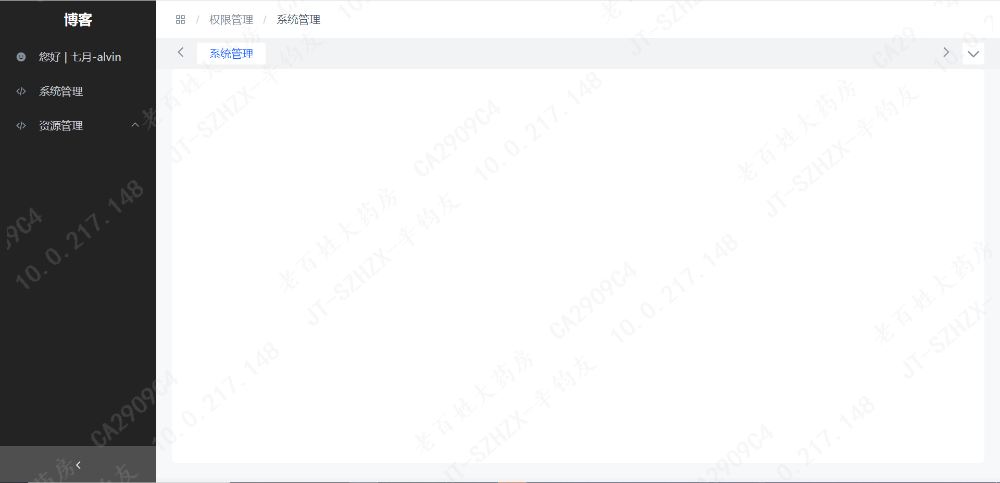
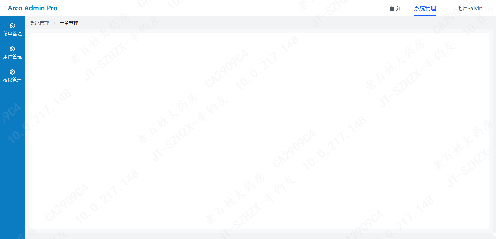
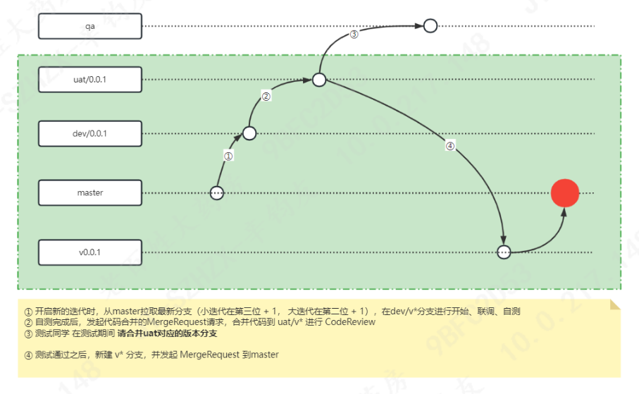

#### 基于Arco 组件库和Vue3的中后台框架






---

#### 快速上手
本项目的技术栈为 vue+ ES2015++ TypeScript + Arco Design和 echarts 等

#### 下载脚手架
```
// 1. 进入到需要新建项目的目录 /workspace
cd /workspace && git clone xxx
// 2. 安装依赖
npm install
// 3. 启动项目
npm run dev
```
> 开发预览：打开 http://localhost:5173/ 就能看到如下页面


#### 浏览器支持

本地开发推荐使用Chrome 最新版浏览器，不支持Chrome 80以下版本。生产环境支持现代浏览器，不支持 IE。


#### 项目目录
```
├─api
│  ├─core     #请求接口的核心逻辑，使用fetch替代axios
│  └─modules  #请求模块
├─assets      #静态资源文件，一般先将文件上传到minio使用http地址
├─components  #项目通用业务组件
│  └─chart    #echart图表
├─config      #项目配置
├─hooks     
├─layout
│  ├─default  #默认的工厂型模板 （权限管理在使用）
│  └─simple   #脚手架默认模板 （数据小站在使用）
├─plugins     #项目插件，注册全局组件
├─router      #页面路由，内置逻辑打通了 权限管理 的登录逻辑
├─store       #项目状态管理
├─styles
├─utils       #工具库
└─views       #页面模板
└─App.vue     #视图入口 
└─main.ts     #入口文件
```


#### 开发规范

##### 命名规范
全部采用小写方式， 以中划线分隔，有复数结构时，要采用复数命名法， 缩写不用复数。

1. 代码中的命名严禁使用拼音与英文混合的方式，更不允许直接使用中文的方式。注意，即使纯拼音命名方式也要避免采用。（正确的 英文拼写和语法可以让阅读者易于理解，避免歧义）
2. VUE 的项目中使用 kebab-case命名。例如组件目录 page-layout。JS、CSS、SCSS、HTML、PNG等全部采用小写方式， 以中划线分隔。
3. 举例：scripts/styles/components/images/utils/layouts/demo-styles/demo-scripts/img/doc

##### 接口规范
本着简单高效的原则，接口不遵守RESTAPI、JSONAPI等常用规范，业务接口只接受GET和POST
> 建议：简单的参数用GET、复杂的参数用POST。例如参数包含有Array时，建议用POST；如果是简单的一两个查询参数时，建议用GET。

- 备注1：请求参数当中不允许出现当前用户操作的用户信息，当前用户信息全部在后端通过后端网关获取，例如userId, userName等。
- 备注2：如遇资源上传相关需求。请将文件上传到minio，具体请参考附注的上传逻辑
- 备注2：如遇资源下载相关需求。前端下载代码参考 文件下载逻辑

#### Git工作流
现阶段前端项目的测试环境、预发布环境代码合并逻辑交由测试或者运维，前端开发同学在下图绿色部分完成代码闭环流转。



#### 页面布局
目前提供两套页面模板可供使用，后续会通过插件注册的方式完成模板自由插拔。
- 默认布局: 屏幕左侧目录，右侧顶部包含路径地址、用户信息和站内页签，右下角大部分区域进行各个页面的主要内容展示。


- 常用布局: 页面顶部包含项目名、一级菜单和用户信息。主要区域左侧展示当前一级菜单下的子菜单，主要区域右侧展示当前页面的主要内容。


#### 菜单与路由
在 src/router/modules 内的 .ts 文件会被视为一个路由模块。一个路由模块包含以下结构，如需要新增路由，在 src/router/modules 内新增一个模块文件，该文件内容会自动完成扫描
```
import { RouteRecordRaw } from 'vue-router';
import DetailLayout from "@/layout/default/detail.vue";

const routeName = "site";

/**
 * @param name 路由名称, 必须设置,且不能重名
 * @param meta 路由元信息（路由附带扩展信息）
 * @param redirect 重定向地址, 访问这个路由时,自定进行重定向
 * @param meta.title 菜单名称
 * @param meta.icon 菜单图标
 * @param meta.keepAlive 缓存该路由
 * @param meta.sort 排序越小越排前
 * @param meta.hiddenMenu 当前路由是否隐藏，默认不隐藏
 * */
const routes: Array<RouteRecordRaw> = [
  {
    path: "/site",
    name: routeName,
    redirect: "/site/dashboard",
    component: DetailLayout,
    meta: {
      title: '站点信息',
      icon: "icon-code",
      sort: 2,
      hiddenMenu: true
    },
    children: [
      {
        path: 'dashboard',
        name: `${routeName}_dashboard`,
        meta: {
          title: '数据看板',
          affix: true,
          icon: "icon-settings"
        },
        component: () => import('@/views/site-info/dashboard/index.vue'),
      },
     ],
  }
]

export default routes;
```

###### 路由刷新
项目当中采用的是重定向的方式实现刷新 `router.push({ path: '/redirect' + unref(route).fullPath });`

###### 页面缓存
在一些特定场景下，用户喜欢在切换页面操作的过程中能够保留上一个页面的操作结果，这个时候就需要开启页面缓存的功能。开启缓存有三个条件
1.在router中meta内将keepAlive 设置为 true
2.路由设置 name，且不能重复
3.路由对应的组件加上 name，与路由设置的 name 保持一致

###### 权限控制
项目框架已和 【权限管理系统】打通，完成登录与菜单权限的管控逻辑。每个环境的接入逻辑如下：

1. 每个项目新增环境时需要通知@陈玉湖(玉湖) 更改后端网关配置并重新部署网关
2. 如果对应环境没有权限，开发环境、测试环境 新增系统找 @辛钧友，生产环境找@王蓉(Chelsea)@肖星(海鸥)。 


###### 状态管理
全局状态管理是一个大型系统不可避免的存在，框架内已经实现了 useUserrStore 用户信息 和 useAsyncRouteStore 路由信息 两个模块。
新增模块代码快如下，useUserStoreWidthOut 主要用于 Vue#setup 之外的代码块。
```
import { defineStore } from "pinia";
import { store } from "@/store";

export interface IUserState {
  isLogin: boolean;}

export const useUserStore = defineStore({
  id: "app-user",
  state: (): IUserState => ({
    isLogin: false,
  }),
  actions: {
    // 获取用户信息
    async getUserInfo() {},
  },
});

export function useUserStoreWidthOut() {
  return useUserStore(store);
}
```

关于 Pinia 带来的众多新特性及用法，大家可以在 Pinia 官网进行学习了解。这里不做过多赘述。


###### 接口
通过洋葱模型对原生fetch请求进行了二次封装和限制，增加了超时处理、header设置 pageId 和 requestId，同时为了降低接口对接难度，只允许使用 GET 和 POST请求。


###### 发布部署
项目根目录下都会内置一个 nginx.conf 和Docker 文件，在新项目每个环境发布时，可以选择使用docker或者k8s部署。


#### 附注
###### 资源上传到minio
为了统一前后端在上传资源的交互和保证信息的安全，由后端生成一个临时上传的miniIO资源地址给到前端，前端上传完成之后通知后端上传成功并获取上传的HTTP URL地址。

前端代码片段
```
// ### 前端通过临时地址上传资源
// tempUrl: minIO的临时上传地址
// file: 需要上传的FILE文件对象
await fetch(tempUrl, { method: 'PUT', body: file });


// ### 前端获取文件内容
// httpUrl: 上传成功之后，后端返回给到前端的http url
const fileContent = await fetch(httpUrl).then(res => res.text());


// ### 将字符串转成file对象
const fileContent = "this is file content.";
const fileName = 'README.md';
const blob = new Blob([fileContent], { type: 'text/plain' });
const file = new File([blob], fileName, { type: 'text/plain' });
```


###### 文件下载
需要在请求当中指定为 blob 类型，并且将请求返回的结果使用 File 对象进行处理。
前端代码片段
```
const downloadFileUrl: string = "xxx";
const data = {};
const downName: string = "xxx" || Date.now();

const res = await axios.request({
  method: 'POST',
  url: `${downloadFileUrl}`,
  data,
  responseType: 'blob',
});

const myFile = new File([res.data], downName, { type: res.data.type });
const fileReader = new FileReader();

fileReader.readAsDataURL(myFile);

fileReader.onload = (e: any) => {
  const url = e.target.result;
  const a = document.createElement("a");
  document.body.appendChild(a);
  a.href = url;
  a.download = downName;
  a.click();
  window.URL.revokeObjectURL(url);
  document.body.removeChild(a);
};
fileReader.onerror = (error) => {
  console.log(error);
};
```


